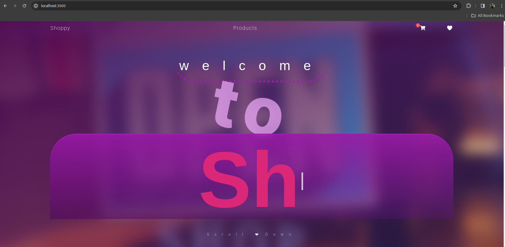
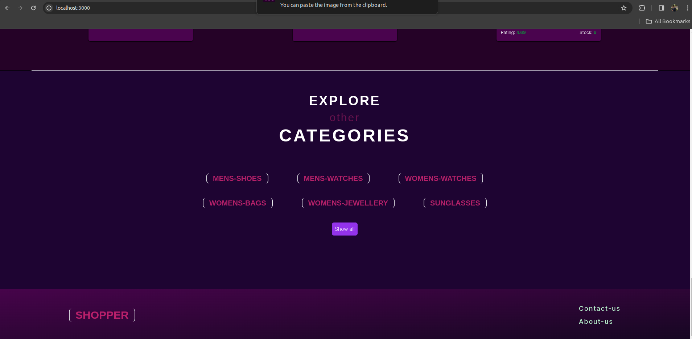
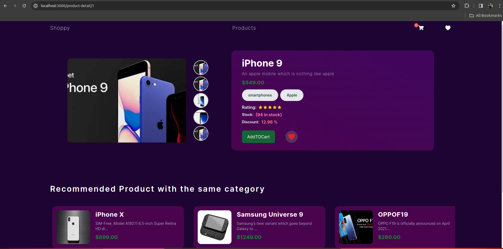
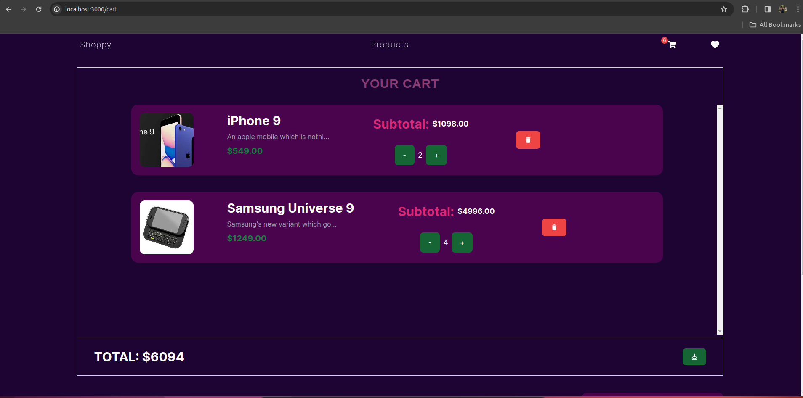

# Shopper Project

Welcome to the shopper Project! This project is a full-fledged e-commerce web application with various features including product filtering, product details, wishlists, shopping cart, and a dummy payment system integration using client-side-only Stripe.



## Features

- **Product Filtering:** Filter products based on rating, category, brand, and prices.
- **Product Detail and Recommendations:** View detailed information about each product and see recommendations for similar products.
- **Wishlist:** Add products to your wishlist for future reference.
- **Shopping Cart:** Add products to your shopping cart and proceed to checkout.
- **Dummy Payment System:** Integration with a client-side-only Stripe payment system for a simulated checkout experience.

## Login/Test Users

```
    username : atuny0
    password : 9uQFF1Lh
```


```
    username : hbingley1
    password : CQutx25i8r
```

```
    username : rshawe2
    password : OWsTbMUgFc
```

## Other Screenshots

### More Categories


### Product Detail Page


### Product Cart


## Demo

Check out the live demo [here](https://shopperproject.vercel.app/).

## Technologies Used

- React.js
- Next.js
- Redux Toolkit
- Tailwind CSS
- Stripe (for dummy payment integration)

## Getting Started

1. Clone the repository:

```bash
    git clone https://github.com/anchalraj31082004/shopper.git
```
2. Go to the project directory and open with VS-Code
```bash
    cd shopper
    code .
```

3. Rename the ```.env.example``` and paste your Stripe API key

4. Install Dependencies

```bash
    npm install
```

5. Run the Developement Server

```bash
    npm run dev
```

6. Open http://localhost:3000 in your browser to view the application.

### This project is currently in [developement](https://github.com/anchalraj31082004/shopper) , so you may face many bugs. Kindly reach out to me for further enquiry and reporting issues if you have. You can create issues in the repo itself and connect me on [twitter](https://twitter.com/AnchalTwt) if you feel like.